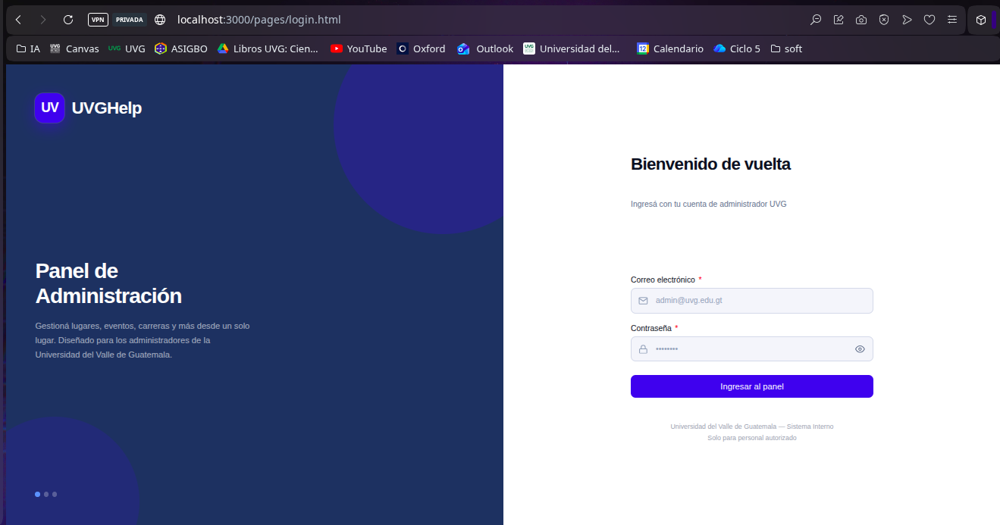
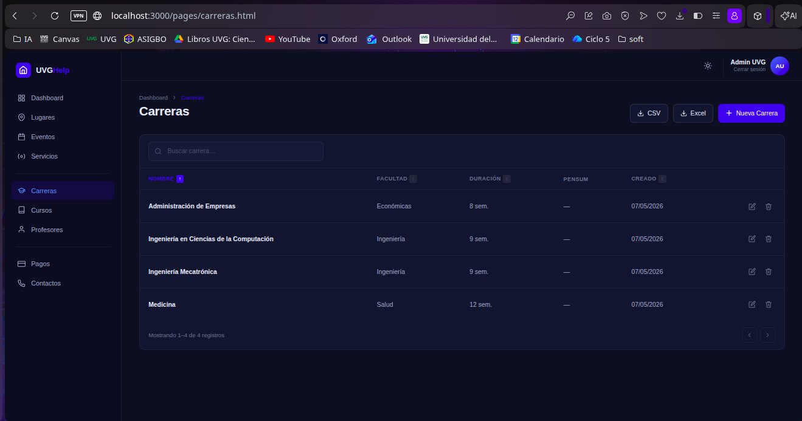
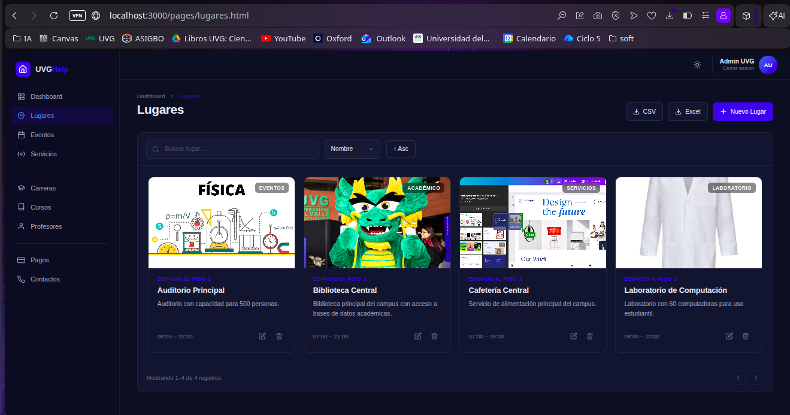
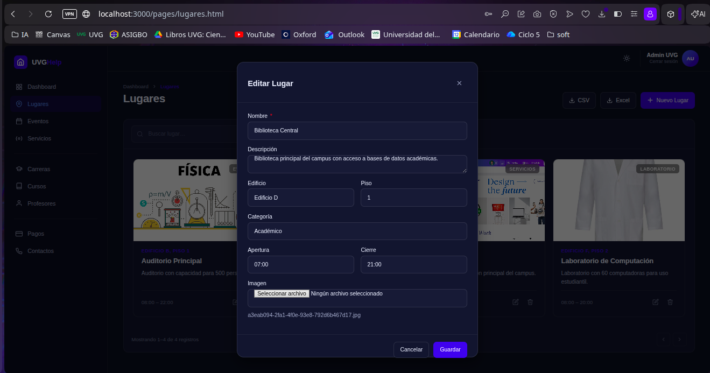

# UVGHelp Admin

## Repositorios

- Frontend: https://github.com/her24770/web-UVGHelp-frontend
- Backend: https://github.com/her24770/web-UVGHelp-backend
- Sitio publicado: https://UVHelp.jhgo.online

Panel de administración para el sistema UVGHelp. Construido con HTML + CSS + JavaScript Vanilla (sin frameworks, sin librerías externas).

## Requisitos

- Docker y Docker Compose (recomendado)
- O cualquier servidor HTTP estático (Live Server, nginx, Python http.server)

## Credenciales de prueba

| Campo    | Valor              |
|----------|--------------------|
| Correo   | admin@uvg.edu.gt   |
| Contraseña | admin123         |

## Correr con Docker

```bash
# 1. Clonar el repositorio
git clone https://github.com/her24770/web-UVGHelp-frontend.git
cd web-UVGHelp-frontend

# 2. Copiar variables de entorno y compose
cp .env.example .env
cp docker-compose.example.yml docker-compose.yml

# 3. Levantar
docker-compose up --build
```

Abre [http://localhost:3000](http://localhost:3000) en tu navegador.

## Correr sin Docker

```bash
# Con Python
python3 -m http.server 3000

# Con Node.js (npx)
npx serve .
```

Abre [http://localhost:3000](http://localhost:3000) en tu navegador.

> El proyecto usa módulos ES nativos (`type="module"`), por lo que necesita un servidor HTTP. No funciona abriendo el archivo directamente desde el sistema de archivos (`file://`).

## Configuración

Las variables de entorno se definen en `.env` (copiá desde `.env.example`):

```bash
API_BASE=http://localhost:8000/api   # URL del backend
TOKEN_KEY=uvg_token                  # clave del JWT en localStorage
```

Al levantar el contenedor Docker, el entrypoint genera automáticamente `js/config.js` con esos valores. Para producción solo cambiá `API_BASE` en el `.env` del servidor.

## Estructura del proyecto

```
├── index.html              # Redirección automática (login / dashboard)
├── pages/                  # Una página HTML por sección
├── js/
│   ├── config.js           # Configuración centralizada (API_BASE, TOKEN_KEY)
│   ├── api.js              # Wrapper fetch() con auth
│   ├── auth.js             # Manejo de JWT
│   ├── router.js           # Protección de páginas
│   ├── utils.js            # Helpers generales
│   ├── components/         # Componentes reutilizables (table, modal, toast…)
│   └── pages/              # Lógica por página
└── css/
    ├── variables.css        # Tokens de diseño
    ├── global.css           # Reset y estilos base
    ├── components/          # Estilos de componentes
    └── pages/               # Estilos por página
```

## Challenges en front-end implementados

- **Exportar a CSV** — generado manualmente en JavaScript sin librerías; incluye BOM UTF-8 para compatibilidad con Excel; descarga directamente desde el navegador
- **Exportar a Excel (.xlsx)** — generado manualmente con formato SpreadsheetML sin librerías de ningún tipo; abre correctamente en Excel y LibreOffice
- **Upload de imágenes** — selección de archivo con vista previa del nombre, envío al backend con validación de tipo y tamaño (máx 1MB)
- **Búsqueda en tiempo real** — con debounce de 300ms para no saturar la API
- **Paginación** — con estado sincronizado en URL (`?page=`)
- **Ordenamiento interactivo** — headers de tabla clickeables con indicador ↑↓ en páginas de tabla; selector de campo y botón asc/desc en páginas de cards
- **Estado en URL** — búsqueda, página, campo de orden y dirección se persisten en los query params con `history.replaceState`; cualquier vista es compartible directamente desde la barra del navegador

## Screenshots






## Reflexión

La mayor parte de las funciones que normalmente se construyen con una librería como paginación, modales, toasts, tablas se implementaron manualmente. Esto hace el proceso más tedioso, pero genera una comprensión mucho más profunda de cómo funcionan esas abstracciones por dentro: el ciclo de renderizado, la carga de datos, las llamadas a la API y el manejo de estado.

Una de las soluciones más interesantes fue la sincronización del estado con la URL. En lugar de perder los filtros o la página actual al recargar, se usó `history.replaceState` para escribir el estado en los query params de la URL. Esto permite que cualquier búsqueda o filtro sea "compartible" directamente desde la barra del navegador, replicando lo que librerías como React Query o el router de Vue hacen automáticamente.

El área que personalmente resultó más tediosa fue el CSS y el diseño visual, no es la parte del desarrollo que más disfruto, pero fue necesaria para que la aplicación se vea como una herramienta real y no como una tarea universitaria.

En cuanto a si volvería a usar Vanilla JS: para producción con un equipo, el proceso es considerablemente más largo y el mantenimiento de componentes hechos a mano escala mal. Pero como método de aprendizaje es muy efectivo: primero entendés la sintaxis y los algoritmos del lenguaje, y luego entendés por qué existen los frameworks y qué problema resuelven exactamente.
